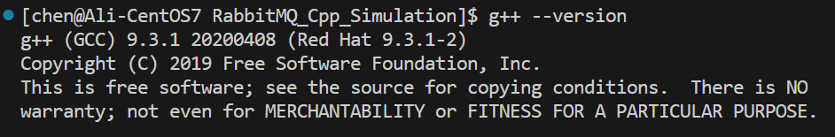
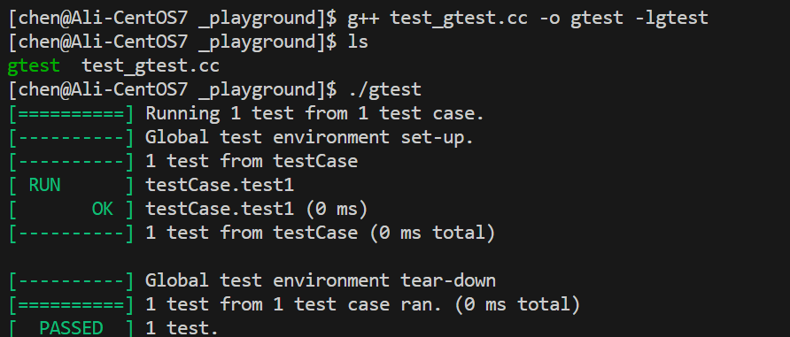

# 一、RabitMQ模拟实现 - 项目介绍

曾经我们学习过**阻塞队列 (BlockingQueue)**。当时我们说阻塞队列最大的用途, 就是用来实现<font color=orange>生产者-消费者模型</font>。生产者消费者模型是后端开发的常用编程方式，它存在诸多好处：
- 解耦合
- 支持并发
- 支持忙闲不均
- 削峰填谷
- ......


在实际的后端开发中, 尤其是分布式系统里, 跨主机之间使用生产者消费者模型, 也是非常普遍的需求。
因此, 我们通常会把阻塞队列封装成一个独立的服务器程序, 并且赋予其更丰富的功能。 这样的服务程序我们就称为 消息队列 (Message Queue, MQ)。市面上成熟的消息队列非常多：
- RabbitMQ
- Kafka
- RocketMQ
- ActiveMQ
- ......

# 二、开发环境
- Linux（Centos-7.6 + Ubuntu-20.04）
- VSCode/Vim
- g++/gdb
- Makefile + CMake

# 三、技术选型
- 开发主语言：**C++**
- 序列化框架：**Protobuf** (二进制序列化&反序列化)
- 网络通信：
    - ~~自定义应用层协议 + 原生socket: 复杂度较高~~
    - **自定义应用层协议** + **muduo库**：对tcp长连接的封装、并且使用epoll的事件驱动模式，实现高并发服务器与客户端
- 源数据信息数据库： **SQLite3** (本地化且轻量)
- 单元测试框架： **Gtest** (Google)

# 四、环境搭建
## 4.1 在CentOS 7.6上搭建开发环境

### 安装wget
```shell
sudo yum install wget
```

### 更新软件源

因为CentOS7已经停服，所有我们需要更换软件源，选择阿里云的软件软
要禁用所有 CentOS 官方软件源，可以将所有相关的 `.repo` 文件重命名或移动到另一个目录中，这样 yum 就不会再使用它们。你可以使用以下命令来完成此操作：

```sh
# 创建一个备份目录
sudo mkdir /etc/yum.repos.d/backup

# 移动所有 CentOS 官方软件源文件到备份目录
sudo mv /etc/yum.repos.d/CentOS-*.repo /etc/yum.repos.d/backup/

# 确认是否还有其他相关的repo文件
ls /etc/yum.repos.d/
```

这样做之后，你可以重新配置其他第三方软件源，例如阿里云的镜像源。以下是一个配置阿里云镜像源的例子：

```sh
sudo wget -O /etc/yum.repos.d/CentOS-Base.repo http://mirrors.aliyun.com/repo/Centos-7.repo

# 清理缓存
sudo yum clean all

# 重新生成缓存
sudo yum makecache
```

这样 CentOS 官方软件源已被禁用，并且系统将使用新的阿里云镜像源。


### 安装scl软件源
```shell
sudo yum install centos-release-scl-rh centos-release-scl
```

### 安装epel软件源
```shell
sudo yum install epel-release
```

### 安装lrzsz传输工具
```shell
sudo yum install lrzsz
```

### 安装高版本gcc/g++编译器
```shell
sudo yum install devtoolset-9-gcc devtoolset-9-gcc-c++
echo "source /opt/rh/devtoolset-9/enable" >> ~/.bashrc
source ~/.bashrc
g++ --version
```


### 安装Git
```bash
sudo yum install git
```

### 安装CMake
```bash
sudo yum install cmake
```


### 安装ProtoBuf
安装Protobuf依赖库
```bash
sudo yum install autoconf automake libtool curl make gcc-c++ unzip
```
下载protobuf包 (可以本地下完压缩包上传服务器)
```bash
wget https://github.com/protocolbuffers/protobuf/releases/download/v21.11/protobuf-all-21.11.tar.gz
```

```bash
# 第一步执行autogen.sh，但如果下载的是具体的某一门语言，不需要执行这一步。
./autogen.sh
# 第二步执行configure，有两种执行方式，任选其一即可，如下：
# 1、protobuf默认安装在 /usr/local 目录，lib、bin都是分散的
./configure
# 2、修改安装目录，统一安装在/usr/local/protobuf下
./configure --prefix=/usr/local/protobuf
```

```bash
make // 执行15分钟左右
make check // 执行15分钟左右
sudo make install
```


可能会在make check 出现错误，例如：


出现以上错误的原因是test的模块里面有非常多的测试用例，这些用例对服务器环境要求特别严格，需要增大下swap分区，具体操作可参考：
https://blog.csdn.net/AlexWang30/article/details/90341172
（建议可以先扩大3G，再执行 make check 。如果还是报错，再扩大到10G重新执行 make
check ）

执行 make check 后 ，出现以下内容就可以执行 sudo make install 。


至此，需要你回忆一下在执行configure时，如果当时选择了第一种执行方式，也就是
./configure ，那么到这就可以正常使用protobuf了。如果选择了第二种执行方式，即修改了安装
目录，那么还需要在/etc/profile 中添加一些内容：

```bash
sudo vim /etc/profile
# 添加内容如下：
#(动态库搜索路径) 程序加载运行期间查找动态链接库时指定除了系统默认路径之外的其他路径
export LD_LIBRARY_PATH=$LD_LIBRARY_PATH:/usr/local/protobuf/lib/
#(静态库搜索路径) 程序编译期间查找动态链接库时指定查找共享库的路径
export LIBRARY_PATH=$LIBRARY_PATH:/usr/local/protobuf/lib/
#执行程序搜索路径
export PATH=$PATH:/usr/local/protobuf/bin/
#c程序头文件搜索路径
export C_INCLUDE_PATH=$C_INCLUDE_PATH:/usr/local/protobuf/include/
#c++程序头文件搜索路径
export CPLUS_INCLUDE_PATH=$CPLUS_INCLUDE_PATH:/usr/local/protobuf/include/
#pkg-config 路径
export PKG_CONFIG_PATH=/usr/local/protobuf/lib/pkgconfig/
```

最后一步，重新执行 /etc/profile 文件:
```c
source /etc/profile
```

检查是否安装成功：

输入 `protoc --version` 查看版本，有显示说明安装成功：


### 安装Muduo
下载源码
```bash
# git方式
git clone https://github.com/chenshuo/muduo.git
# 备用下载地址
wget https://gitee.com/hansionz/mq/raw/master/resource/muduomaster.zip
```


修复muduo库安装protorpc的时候没有安装
```bash
muduo-master/muduo/net/protorpc/CMakeLists.txt
```

安装依赖环境
```bash
sudo yum install gcc-c++ cmake make zlib zlib-devel boost-devel
```

运行脚本编译安装

```bash
./build.sh
./build.sh install
```

验证是否编译安装成功

```bash
# 切换编译目录
cd ../build/release-cpp11/bin/

make

# 运行protobuf-demo服务端
./protobuf_server 9091

# 运行protobuf-demo客户端
./protobuf_client 0.0.0.0 9091
```

### 安装SQLite3
```bash
sudo yum install sqlite-devel
# 验证是否安装成功
sqlite3 --version
```


### 安装Gtest
```bash
sudo yum install epel-release
sudo yum install dnf
sudo dnf install dnf-plugins-core
sudo dnf install gtest gtest-devel
```

测试GTest是否安装成功，编写测试代码test_gtest.cc：
```cpp
#include <gtest/gtest.h>
int add(int a,int b) {
    return a+b;
}

TEST(testCase,test1) {
    EXPECT_EQ(add(2,3),5);
}

int main(int argc,char **argv) {
    testing::InitGoogleTest(&argc,argv);
    return RUN_ALL_TESTS();
}
```

编译源文件
```bash
g++ test_gtest.1 cc -o gtest -lgtest
```

运行可执行文件
